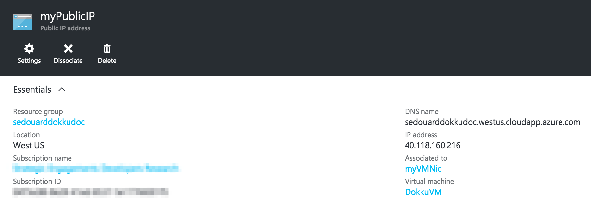
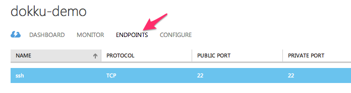
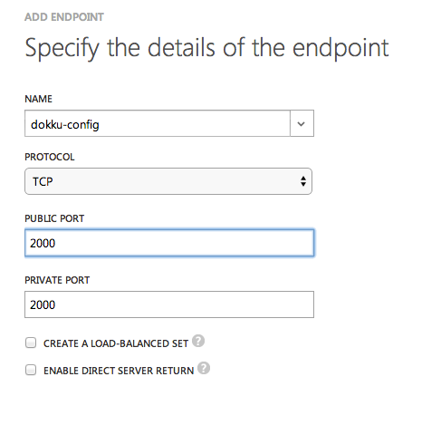
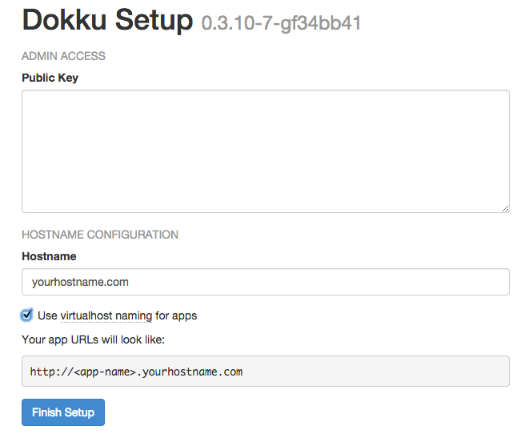
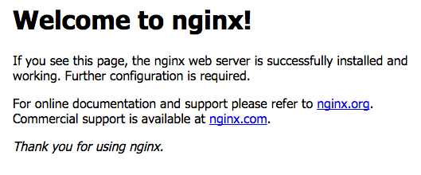
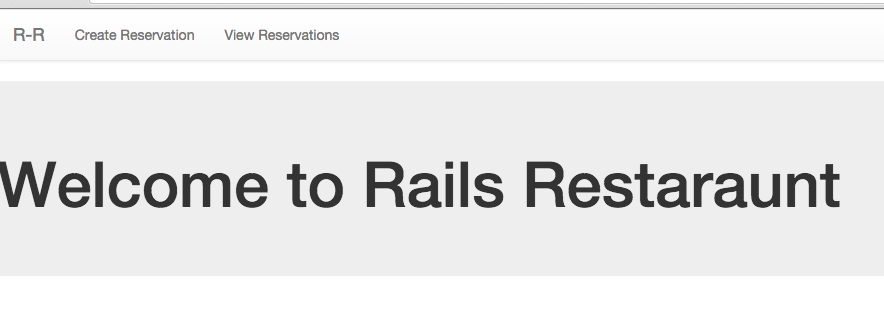

# Heroku Meets Azure - The Easiest Way to Deploy Your Rails App

[Heroku](http://heroku.com) pretty much created the gold standard of Platform as a Service (PaaS) web deployments for open source web stacks based on Ruby, Python, Node and Php.

Microsoft Azure also offers a similar service as Heroku called [Azure Websites](http://azure.microsoft.com/en-us/services/websites/). This service handles automagic deployments via Git and popular source control providers like [Github](http://github.com) and [Bitbucket](http://bitbucket.com). 

Although Azure Websites has support for .NET and mostly supports PHP, Node, and Python it has no support for Ruby. In addition somethings like [native module](http://azure.microsoft.com/en-us/documentation/articles/nodejs-use-node-modules-azure-apps/) are not supported on the platform. 

Also, Azure Websites under the covers is Windows-based and there is no Linux option, making some subtle Windows-specific issue appear in your deployment environment when it may not happen in your development environment.

I did some digging and there's a great open-source framework called [Dokku](https://github.com/progrium/dokku) which is basically Heroku-in-a-box. That means that you can run all of your open source stacks with a simple `git push` command with the huge power of Azure behind your back. 

Dokku will automatically launch your Ruby, PostgreSql, Node, Python, MongoDB etc service easily with docker containers. What does this mean?

**YOU CAN BASICALLY RUN HEROKU ON AZURE**

How awesome is that?

Now I'm personally I'm an [Express](http://expressjs.com) developer and prefer smaller web frameworks, which is pretty much the opposite of Rails. However I do understand there are a ton of people who love Rails and I'd love to see more Rails sites deployed on Azure.

Keep reading for this quick how-to:

# Getting Started with Dokku

Before you get started, you're gonna need your own Domain name. The way it works is that Dokku will place your apps in subdomains of the domain that you give it. For example say that you had a Node app and a Rails app deployed. You would access those apps from:

```
http://rails-app.my_dokku_domain.com
http://node-app.my_dokku_domain.com
```

## Getting the CLI Setup

Make sure you have an [Azure subscription](http://azure.microsoft.com/en-us/) and install [Nodejs](http://nodejs.org).

```
npm install azure-cli -g
# this will open up your default browser so you can sign in and download your .publishsettings file
azure account download
```

## Creating a Linux VM

I personally love using Ubuntu because its so user friendly. With Dokku, you'll want to be using Ubuntu 14.04 LTS as thats where it is supported best:

```
# grep for all ubuntu 14.04 vms
azure vm list | grep 14_04
# create your ubuntu vm
azure vm create your-vm-name b39f27a8b8c64d52b05eac6a62ebad85__Ubuntu-14_04_1-LTS-amd64-server-20141125-en-us-30GB user_name -l 'West US' --ssh 22
```

West US is a data center name. You can list the available azure deployment locations by doing

```
azure vm location list
```

You'll be prompted for a password - this is one you'll use to ssh into the machine.

## Installing Dokku-alt

In this guide, I'm going to use [Dokku-alt](http://github.com/dokku-alt/dokku-alt) which is a great fork of Dokku and is basically Dokku on steroids. It has extended plugins preinstalled for PostgreSql, Mongodb, Node/Express, Ruby/Rails -- you name it, you got it. The repo has great installation instructions and mine are based off of those but specifically for Rails and PostgreSql.

To install, just run this simple bootstrapping shell script:

```
sudo bash -c "$(curl -fsSL https://raw.githubusercontent.com/dokku-alt/dokku-alt/master/bootstrap.sh)"
```

Afterwards the script will kick off a Sinatra web server where you can access the configuration portal. This is the easiest way to configure the dokku server although you can [configure it manually](https://github.com/dokku-alt/dokku-alt#manual-configuration) as well.

## Setting up a Domain Name

You're going to need a domain from a domain name service provider like [Godaddy](http://godaddy.com) or [Namecheap](http://namecheap.com).

In your DNS zone file create two A entries:

From  | To
------------- | -------------
@  | (your azure virtual ip)
*  | (your azure virtual ip)

You can get your virtual IP address from your virtual machine dashboard on the right hand side (again, using the class manage.windowsazure.com portal):



## Opening up the HTTP and Configuration Endpoints

Although Dokku serves its 1st experience configuration dashboard through port 2000, and hosts websites through port 80, you can't actually get to those from the outside world until you open up those endpoints.

Go to your virtual machine in the classic azure portal (portal.windowsazure.com) and select the endpoints menu:



## Configuring Dokku

Open ports **2000** and **80** since you'll be operating HTTP traffic to and from your site:



Navigate to `http://your-domain-name.com:2000` and you'll see the Dokku admin portal waiting for you:



Now you can validate everything is working A-OK if you can navigate to `http://yourdomainname.com` and see the generic nginx server message:



Now you have your domain setup!

## Configuring Dokku

The first thing it wants from you is your public key. This is super easy to do, just do:

```
cd ~/.ssh
ssh-keygen id_rsa
# enter a good passphrase
ls
# now you'll see two files id_rsa and id_rsa.pub
# copy the output from the command below
cat id_rsa.pub
```

Now paste to the 'public key' box on the dokku setup website.

Next, enter your domain name (such as `my_dokku_host.com`), by default Dokku will just launch your app to a specific port but on Azure, since it will detect the domain your-vm-name.cloudapp.net, Dokku will automatically use that.

Thats's it! The web page should redirect you to the dokku-alt repository afterwards. 

## Deploying your Rails App

This guide goes into launching a Ruby app but you can easily launch most other types of apps to!

You can use your current Rails app or Clone [this app](https://github.com/sedouard/rails-restaurant) as an example. This app is a 'restaurant reservation' app and cut me some slack, aside from not being the worlds best front-end developer, I built it within 24 hours of learning Ruby and Rails :-).

The app requires a a PostgreSql server and we'll deploy that after deploying the app.

In your git repository add a new remote to your server:

```
git remote add dokku dokku@<your_domain_name>.com:your_app_name
```

Note that using the user name `dokku` is required!

Now just push the repository! Your ssh key you created in your `~/.ssh` folder should authenticate you. The remote repository is created on-the-fly by Dokku.

```
git push dokku master
remote: -----> Building rails-app2 using buildstep...
remote: -----> Installing ENV in build environment ...
-----> Using u1000 to run an application
-----> Ruby app detected
-----> Compiling Ruby/Rails
-----> Using Ruby version: ruby-2.0.0
...blah...blah...blah
remote: -----> Injecting git revision
remote: -----> Releasing rails-app2 ...
remote: -----> Deploying rails-app2 ...
remote: -----> Shutting down old containers
remote: =====> Application deployed:
remote:        http://yourapp.yourdomain.com
remote: -----> Cleaning up ...
```

Note: if you do this for your own app, make sure that you include a Procfile like [this one](https://github.com/sedouard/rails-restaurant/blob/master/Procfile). If you're already familiar with Heroku you'll know that its required for Heroku apps.


## Setting up PostgresSql

Finally this app needs to have a database, if you notice, browsing to your app doesn't work, thats because you need to tell dokku to launch and link a PostgreSql to your app. This is really easy though. In this app, you'll see that our [database.yml](config/database.yml) contains a url with an environment variable that is injected by Dokku. This is what happens on the Heroku platform as well:

```
production:
  <<: *default
  database: my_database_production
  url: <%= ENV['DATABASE_URL'] %>
```

To do this, ssh into your virtual machine:

```
ssh user_name@your_domain.com
```

Tell Dokku you want a PostgreSql database:

```
dokku postgresql:create app_name
```

**Important:** app_name must be the name of the app you deployed!

Linking your Postgresql database container to your Rails app container is easy:

```
dokku postgresql:link app_name database_name
```

Since we're using rails, we have to do a database migration. In order to do this we can tell dokku to run the rake command within the Rails container by simply doing:

```
dokku run app_name rake db:migrate
```

And thats it! Navigate to http://app_name.your_domain.com and you should see my super basic app running:



Try creating a reservation and viewing them, this demonstrates that the database is actually up and running on your Dokku host.

## In Closing...

Hope this helps you get your own 'Heroku' running on your cloud platform of choice. 

With Dokku, you can pretty much run your entire application stack and it takes a lot of the nuances away of running particular services with the speed of docker containers. What's even more awesome are the plugins for the various types of databases you may want to launch as well.

Go fourth and conquer!